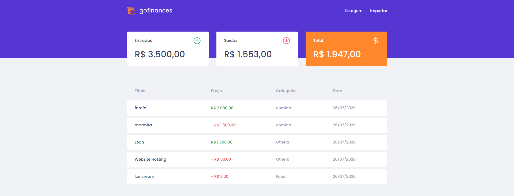
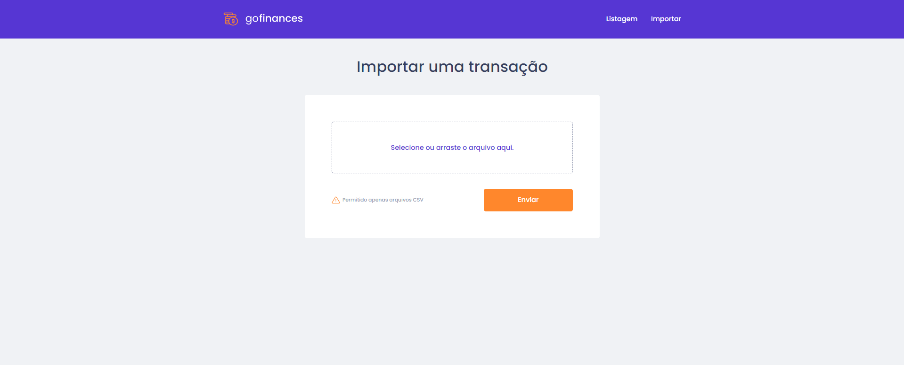

<h1 align="center">
  
</h1>

<h1>
  
  
</h1>

# Indice
- [Sobre](#-sobre)
- [Tecnologias utilizadas](#-tecnologias-utilizadas)
- [Como baixar o projeto](#-como-baixar-o-projeto)

---

## 🧾Sobre

O Projeto **GoFinances** é um sistema para controle de finanças pessoais. O sistema foi desenvolvido durante o **Bootcamp GoStack** da RocketSeat com a finalidade de aplicarmos os conhecimentos estudados.

---

## 🛠Tecnologias utilizadas

O Projeto foi desenvolvido utilizando as seguintes tecnologias

- [Reactjs](https://reactjs.org)
- Axios
- Typescript
- Styled-components

---

## 💾 Como baixar o projeto

### Web

```bash

# Clonar o Repositório
$ git clone https://github.com/ArielCrivellaro/GoFinancesWeb.git

# Entrar no Repositório
$ cd GoFinancesWeb

# Instalar as dependências
$ yarn install

# Iniciar o Projeto
$ yarn start

```
---

### Desenvolvido por 😎 Ariel Crivellaro Martins
